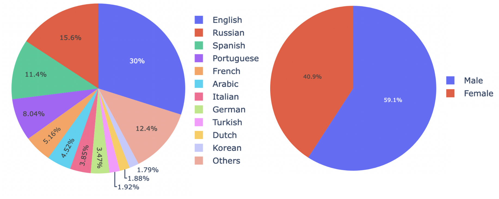

The VoxTube is a multilingual speaker recognition dataset collected from the **CC BY 4.0** YouTube videos. It includes more than **5.000 speakers** pronouncing more than **4 million utterances** in more than **10 languages**. The work is conducted by [ID R&D Inc](https://www.idrnd.ai). For the collection and filtering details please see [[1]](#citation).

## Data description

| Dataset properties           | Stats     |
|:-----------------------------|:----------|
| # of POI                     | 5.064     |
| # of videos                  | 308.883   |
| # of segments                | 4.481.060 |
| # of hours                   | 4.979     |
| Avg # of videos per POI      | 61        |
| Avg # of segments per POI    | 885       |
| Avg length of segments (sec) | 4         |

###  Language and gender distributions


## Examples and data downloading

Please go to the [examples page](./examples/README.md).


## License

The dataset is licensed under **CC BY-NC-SA 4.0**, please see the complete version of the [license](LICENSE).

Please also note that the provided metadata is relevant on the February 2023 and the corresponding CC BY 4.0 video licenses are valid on that date. ID R&D Inc. is not responsible for changed video license type or if the video was deleted from the YouTube platform. If you want your channel meta to be deleted from the dataset, please [contact us](https://www.idrnd.ai/contact-us) with a topic *"VoxTube change request"*.


## Citation

Please cite the paper below if you make use of the dataset:

```
[1] I. Yakovlev, A. Okhotnikov, N. Torgashov, R. Makarov, Y. Voevodin, K. Simonchik
VoxTube: a multilingual speaker recognition dataset  
INTERSPEECH, 2023.
```